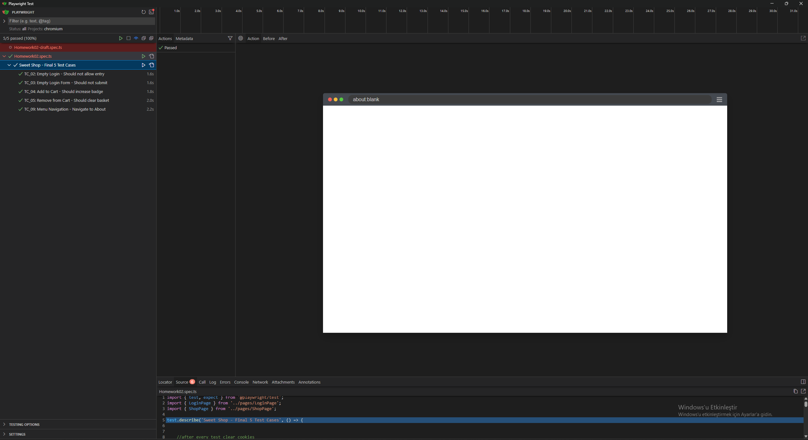
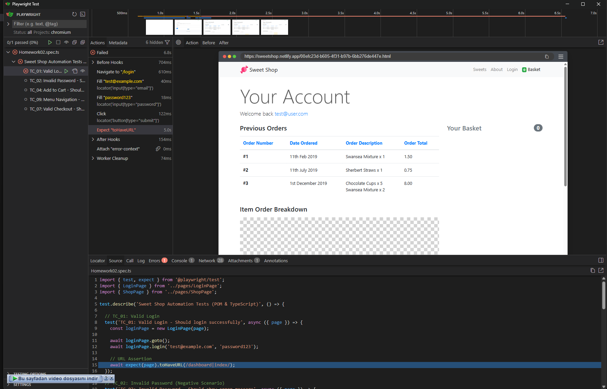
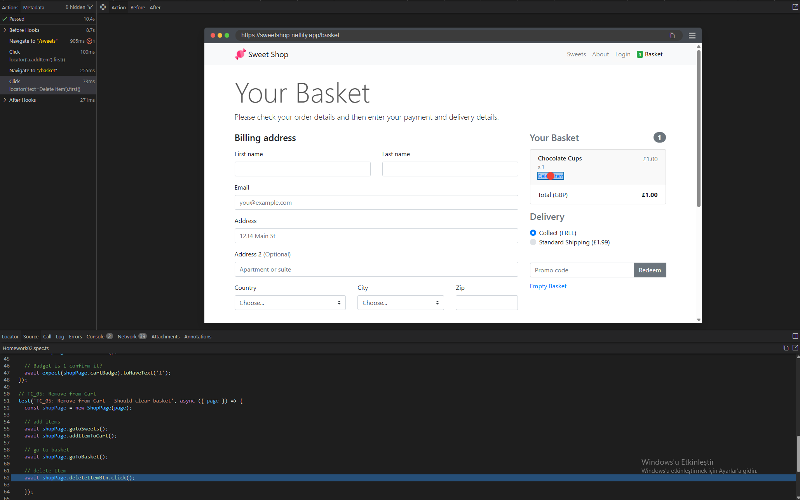

# Sweet Shop — Playwright E2E Test Suite ✅

A concise Playwright end-to-end test suite for the **Sweet Shop** demo application used in Homework 02. The tests verify key flows like login, form validation, cart behavior, page navigation, and UI badge/count updates.

---

## 🔍 Project Overview

- **What it is:** An automated test suite written with **Playwright** (`@playwright/test`) that verifies the main user flows of the Sweet Shop demo (login, shopping cart, About page, form validation).
- **Main files:**
  - `tests/Homework02.spec.ts` — test scenarios
  - `pages/LoginPage.ts` — page object for login
  - `pages/ShopPage.ts` — page object for shop/cart
  - `playwright.config.ts` — Playwright configuration
- **Artifacts / outputs:** `playwright-report/` (HTML reports), `test-results/` (raw test-run data and traces)

---

## 📸 Example Screenshots







---

## ⚙️ Prerequisites

- Node.js (LTS recommended, e.g., Node 18+)
- npm (bundled with Node)
- Windows or Linux terminal/shell access

---

## 💻 Installation (Windows & Linux)

Open a terminal in the repository `Test-Cases` folder.

1. Install dependencies:

```bash
npm install
```

2. Install Playwright browsers:

```bash
npx playwright install
```

3. (Linux only) If Chromium needs extra OS libraries:

```bash
npx playwright install-deps
```

**Optional:** Add convenient npm scripts to `package.json` (example):

```json
"scripts": {
  "test": "npx playwright test",
  "test:headed": "npx playwright test --headed",
  "show-report": "npx playwright show-report"
}
```

---

## ▶️ Run tests

- Run all tests (headless, default):

```bash
npx playwright test
```

- Run tests in a specific browser (headed example):

```bash
npx playwright test --project=chromium --headed
```

- Run a single test file:

```bash
npx playwright test tests/Homework02.spec.ts
```

- Run tests by title:

```bash
npx playwright test -g "Should login successfully"
```

---

## 📊 View reports & traces

- Open the HTML report after a run:

```bash
npx playwright show-report
```

- Raw artifacts and traces:
  - `playwright-report/`
  - `test-results/`

---

## ✅ Test cases covered (high-level)

This suite includes E2E scenarios such as:

- Login success and negative login scenarios (empty input, incorrect credentials)
- Form validation tests (prevent empty form submission)
- Cart operations: add to cart, remove from cart, clear basket
- Badge/count updates when adding/removing items
- Navigation to About page and other UI flow checks

For exact test names, see `tests/Homework02.spec.ts` and historical runs in `test-results/`.

---

## 🔧 Troubleshooting & Tips

- If tests fail due to missing browser libraries on Linux, run:

```bash
npx playwright install-deps
```

- Use `--headed` to observe actions during debugging.
- Increase timeouts in `playwright.config.ts` for slow environments.
- Re-run flaky tests and inspect traces in `test-results/` to identify flakiness.

---

## 💡 Notes

- This repository uses `@playwright/test` as a devDependency (see `package.json`).
- To add CI integration, create a job that runs: `npm ci && npx playwright install && npx playwright test`.

---

If you'd like, I can also:
- Add the suggested npm scripts to `package.json`,
- Create a sample GitHub Actions workflow for running tests on push, or
- Tailor the README wording to your preferred style.

---

© Homework 02 — Sweet Shop Test Suite
